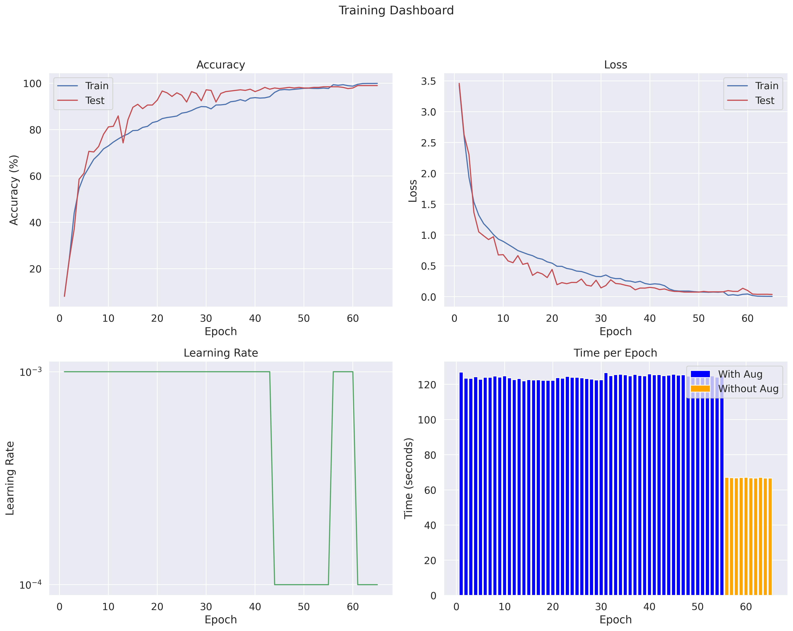
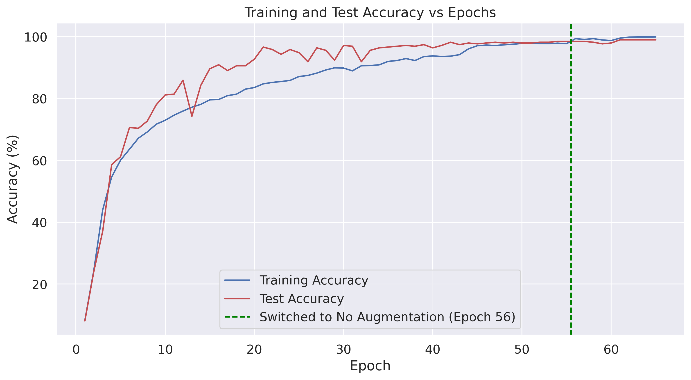
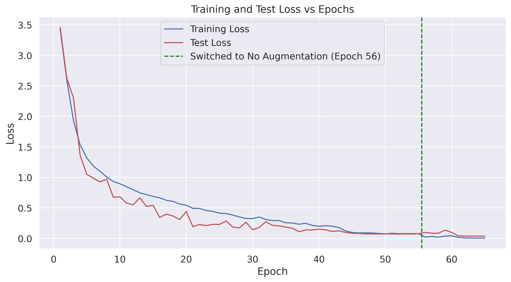
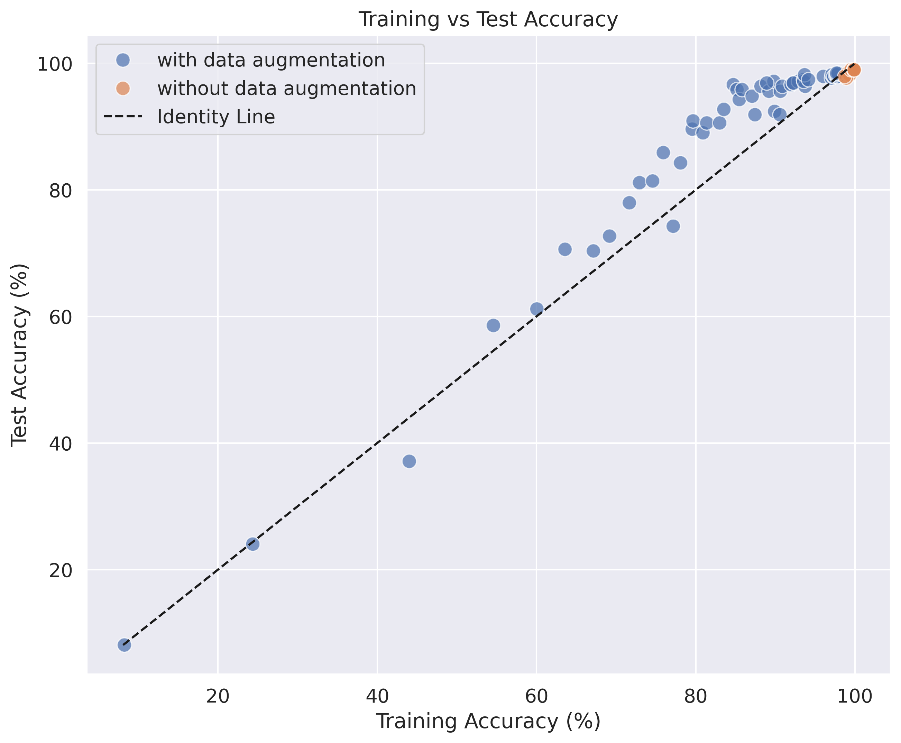
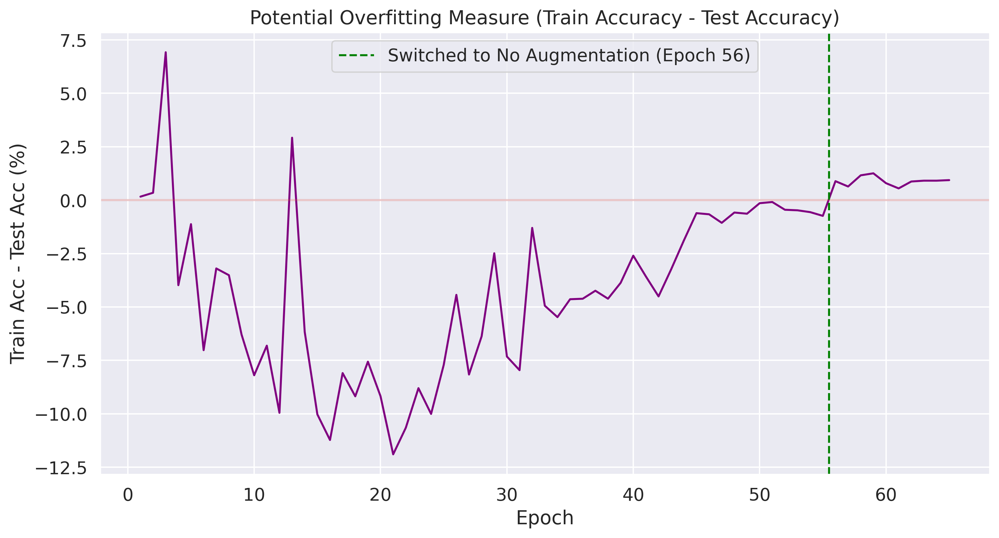
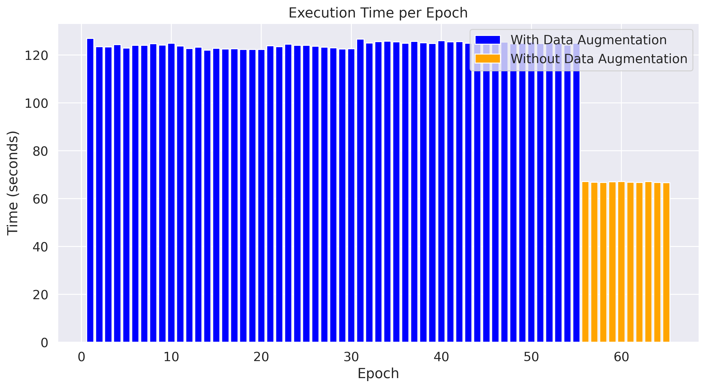
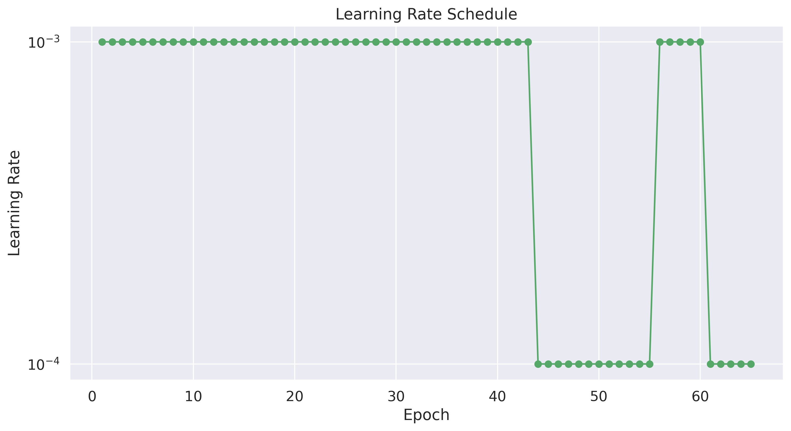

# Playing Cards Image Classification 🃏

[](https://www.python.org/downloads/)
[](https://pytorch.org/)
[](https://opensource.org/licenses/MIT)

<p align="center">
  
</p>

## 📋 Project Overview
This project implements a deep learning model for classifying images of playing cards into 53 different classes (52 standard cards plus joker). The model can accurately identify the suit and value of playing cards from images, achieving approximately 98.4% accuracy on the test dataset. This solution addresses the challenge of automatically recognizing playing cards in various lighting conditions, angles, and backgrounds.

## 🧠 Model Architecture
The architecture is a custom CNN (Convolutional Neural Network) with several advanced features:

- **Bottleneck Blocks**: Inspired by ResNet architecture, these blocks use 1x1 convolutions to reduce parameters while maintaining performance. Each bottleneck block follows a three-layer pattern: 1x1 convolution for dimension reduction, 3x3 depth-wise convolution for feature extraction, and 1x1 convolution for dimension restorations:
- **Squeeze-and-Excitation (SE) Blocks**: These blocks adaptively recalibrate channel-wise feature responses by explicitly modeling interdependencies between channels. The SE mechanism uses global average pooling followed by two fully connected layers with sigmoid activation to generate channel-wise attention weights.
- **Skip Connections**: Implemented to help with gradient flow and mitigate the vanishing gradient problem. Skip connections allow the network to learn residual functions, making optimization easier during training.
- **Spatial and Classifier Dropout**: Two types of dropout are used to prevent overfitting. Spatial dropout (25%) is applied to entire feature maps, while classifier dropout (45%) is applied before the final classification layer.
- **Deep Architecture**: The model consists of 5 stages with multiple bottleneck blocks, providing sufficient depth to learn hierarchical features. The network progressively increases channel dimensions (64→128→256→512→1024) while reducing spatial dimensions through strided convolutions.

The model uses GELU activation functions throughout, which provide smoother gradients than ReLU and have shown better performance in many deep learning tasks. The final architecture contains approximately 7 million parameters, striking a balance between model capacity and computational efficiency.

### Architecture Diagram
```
Input Image (224×224×3)
    ↓
Initial Conv (3×3, stride 2) → 64 channels
    ↓
Stage 1: 2× Bottleneck Blocks + SE
    ↓
Stage 2: 2× Bottleneck Blocks (first with stride 2) + SE
    ↓
Stage 3: 3× Bottleneck Blocks (first with stride 2) + SE
    ↓
Stage 4: 3× Bottleneck Blocks (first with stride 2) + SE
    ↓
Dropout (p=0.15 (late 0.25))
    ↓
Stage 5: 2× Bottleneck Blocks (first with stride 2) + SE
    ↓
Global Average Pooling
    ↓
Dropout (p=0.30 (late 0.45))
    ↓
Fully Connected (1024 → 53 classes)
```

## 🛠️ Techniques & Tools
- **PyTorch**: Main deep learning framework used for model development
- **CUDA Acceleration**: GPU-based computation for faster training
- **Automatic Mixed Precision (AMP)**: Reduces memory usage and speeds up training by using half-precision (FP16) where appropriate
- **GradScaler**: Works with AMP to prevent underflow in gradient calculations
- **Data Augmentation**: Comprehensive augmentation pipeline including:
  - Random resized crops
  - Horizontal flips
  - Color jittering
  - Random rotation
  - Random grayscale conversion
- **Adaptive Learning Rate**: ReduceLROnPlateau scheduler to adjust learning rates based on validation performance
- **Batch Normalization**: Applied throughout the network to stabilize training
- **Best Model Saving**: Automatic saving of the best model based on validation accuracy

## 🔄 Training Process
The training process involves several key steps:

1. **Data Preparation**: The dataset is split into train/validation/test sets
2. **Data Preprocessing**: Images are normalized with mean (0.5, 0.5, 0.5) and std (0.5, 0.5, 0.5)
3. **Data Augmentation**: Applied to the training set to increase diversity
4. **Training Configuration**:
   - Batch size: 128
   - Learning rate: 0.001
   - Optimizer: Adam
   - Loss function: Cross Entropy Loss
   - Classifier dropout: 0.3 (late 0.45)
   - Spatial dropout: 0.15 (late 0.25)
5. **Training Loop**: The model is trained for multiple epochs with validation after each epoch
6. **Learning Rate Schedule**: ReduceLROnPlateau with factor=0.1, patience=5, min_lr=1e-6
7. **Model Checkpointing**: Best model saved based on validation accuracy

## 📊 Training Results

| Metric | Value |
|--------|-------|
| Final Test Accuracy | 98.4% |
| Best Epoch | 61-65 (plateau) |
| Total Training Time | ~2.25 hours |
| Total Epochs | 65 |
| With Data Augmentation | 55 epochs |
| Without Data Augmentation | 10 epochs |
| Avg. Time per Epoch (with aug.) | 124.6 seconds |
| Avg. Time per Epoch (without aug.) | 66.9 seconds |

## 📁 Dataset
The project uses the [Cards Image Dataset Classification](https://www.kaggle.com/datasets/gpiosenka/cards-image-datasetclassification) from Kaggle, which includes:
- 53 different classes of playing cards
- Training, validation, and test splits (7,625 training, 265 validation, 265 test images)
- Clean background images of cards in various orientations

Custom test images were also used, demonstrating that the model works well with:
- "Redacted" photos: Cards with clear visibility (100% accuracy)
- Non-redacted photos: More challenging real-world images (20% accuracy)

This highlights the importance of dataset quality and the challenges in generalizing to real-world conditions.

## 📈 Visualizations
The training process is closely monitored through a comprehensive suite of visualizations that provide deep insights into model performance and training dynamics:

### Training and Validation Metrics
<p align="center">
  
  
</p>

- **Accuracy Curves**: Tracks classification accuracy on both training and validation sets across epochs, with a clear demarcation showing when data augmentation was switched off. The final validation accuracy of approximately 98.4% demonstrates the model's strong performance on unseen data.
- **Loss Curves**: Shows training and validation loss trends over epochs, revealing how well the model is learning and generalizing. The convergence pattern demonstrates stable learning with minimal overfitting.
- **Learning Rate Schedule**: Visualizes the adaptive learning rate strategy on a logarithmic scale, showing how the rate decreases when validation performance plateaus. This confirms the effectiveness of the ReduceLROnPlateau scheduler.
- **Moving Average Plot**: Provides a smoothed trend line (window size=3) for test accuracy, making it easier to identify the overall improvement trajectory without epoch-to-epoch fluctuations.

### Performance Analysis
<p align="center">
  
  
</p>

- **Train vs Test Accuracy Scatter Plot**: Shows the relationship between training and validation accuracy, with points colored by training phase (with/without data augmentation). The plot includes an identity line that helps visualize potential overfitting.
- **Overfitting Measure**: Plots the difference between training and validation accuracy over time, providing a direct visualization of generalization performance. Values closer to zero indicate better generalization.
- **Correlation Heatmap**: Reveals relationships between different training metrics (epoch, loss, accuracy, time) through a color-coded correlation matrix, helping identify which factors are most strongly related.

### Efficiency Metrics
<p align="center">
  
  
</p>

- **Execution Time**: Bar chart showing the time taken for each epoch, with color coding to distinguish between epochs with and without data augmentation. This visualization highlights the computational cost difference between training strategies.

### Comprehensive Dashboard
- **Training Dashboard**: A 2×2 grid of key metrics (accuracy, loss, learning rate, and execution time) providing a holistic view of the training process. This consolidated view makes it easier to spot relationships between different aspects of model training.

All visualizations are automatically generated from training logs and saved as high-resolution PNG files in the 'plots' directory, enabling detailed post-training analysis and inclusion in documentation or presentations.

## 🔍 Research & Decisions
Key design decisions made during development:

1. **Custom Architecture**: Instead of using a standard architecture like ResNet, a custom CNN was developed to specifically address the card classification task with an emphasis on efficiency
2. **SE Blocks**: Added to improve the model's ability to focus on important features in card images
3. **GELU Activations**: Chosen over ReLU for smoother gradients and better performance
4. **Two Types of Dropout**: Spatial dropout for feature maps and classifier dropout before the final layer to prevent overfitting
5. **AMP Implementation**: Added to speed up training and reduce memory consumption
6. **Data Augmentation Strategy**: Carefully designed to reflect the types of variations expected in card images (rotation, lighting changes)
7. **Two-Phase Training**: Started with data augmentation for 55 epochs, then fine-tuned without augmentation for 10 epochs to improve final accuracy

## 📝 License
This project is licensed under the MIT License - see the LICENSE file for details.
